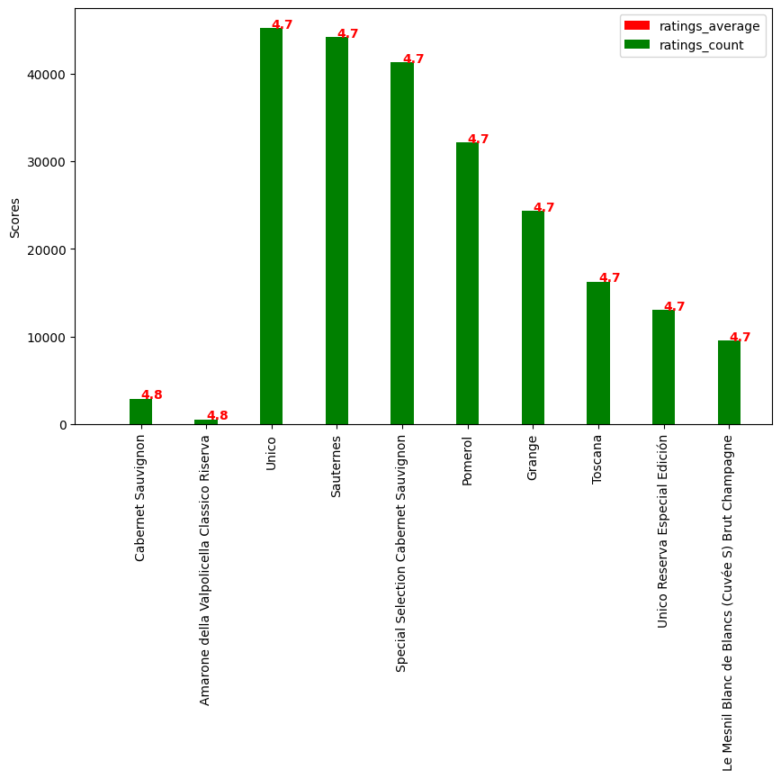

Countries-17
Varieties of grapes-21
Flavour groups -13
Taste(keywords)-450
Mostly wineries have only one set up, 51 wineries have more than one
Wineries – No.of
 	Winery_name	frequency
1	Brunello di Montalcino	20
2	Brunello di Montalcino Riserva	18
3	Pomerol	13
4	Amarone della Valpolicella Classico	10
5	Corton-Charlemagne Grand Cru	10
6	Charmes-Chambertin Grand Cru	9
7	Cabernet Sauvignon	8
8	Saint-Émilion Grand Cru (Premier Grand Cru Cla...	8
9	Amarone della Valpolicella	7
10	Chambertin Grand Cru	5
11	Saint-Julien (Grand Cru Classé)	5
12	Tinto	5

+----+---------------------------------------------+-----------+
|    |               Winery_name                   | frequency |
+----+---------------------------------------------+-----------+
| 1  |         Brunello di Montalcino               |    20     |
| 2  |    Brunello di Montalcino Riserva            |    18     |
| 3  |                 Pomerol                       |    13     |
| 4  | Amarone della Valpolicella Classico           |    10     |
| 5  |     Corton-Charlemagne Grand Cru              |    10     |
| 6  |      Charmes-Chambertin Grand Cru             |    9      |
| 7  |           Cabernet Sauvignon                  |    8      |
| 8  | Saint-Émilion Grand Cru (Premier Grand Cru Cla...|    8      |
| 9  |        Amarone della Valpolicella             |    7      |
| 10 |           Chambertin Grand Cru                |    5      |
| 11 |    Saint-Julien (Grand Cru Classé)            |    5      |
| 12 |                   Tinto                       |    5      |
+----+---------------------------------------------+-----------+

Countries who have achieved better ranking compared with last year
 	rank	previous_rank	Award name	country_code
0	1	11	Bestsellers in Málaga	es
1	1	12	Bestsellers in Singapore	sg
2	1	4	Bestsellers in Italy	it
3	1	14	Bestsellers in Córdoba	es
4	2	9	Bestsellers in Ireland	ie
5	2	15	Bestsellers in New Mexico	us
6	3	8	Bestsellers in Tennessee	us
7	3	11	Bestsellers in Yukon	ca
8	4	17	Bestsellers in British Columbia	ca
9	5	12	Bestsellers in Germany	de
10	5	9	Bestsellers in Italy	it

+----+-----------------------------+----------------+---------------------+--------------+
|    |            rank             | previous_rank  |     Award name      | country_code |
+----+-----------------------------+----------------+---------------------+--------------+
| 0  |              1              |       11       | Bestsellers in Málaga|      es      |
| 1  |              1              |       12       | Bestsellers in Singapore|    sg      |
| 2  |              1              |       4        | Bestsellers in Italy|       it      |
| 3  |              1              |       14       | Bestsellers in Córdoba|     es      |
| 4  |              2              |       9        | Bestsellers in Ireland|     ie      |
| 5  |              2              |       15       | Bestsellers in New Mexico|   us      |
| 6  |              3              |       8        | Bestsellers in Tennessee|    us      |
| 7  |              3              |       11       | Bestsellers in Yukon|       ca      |
| 8  |              4              |       17       | Bestsellers in British Columbia| ca |
| 9  |              5              |       12       | Bestsellers in Germany|      de      |
| 10 |              5              |       9        | Bestsellers in Italy|       it      |
+----+-----------------------------+----------------+---------------------+--------------+

